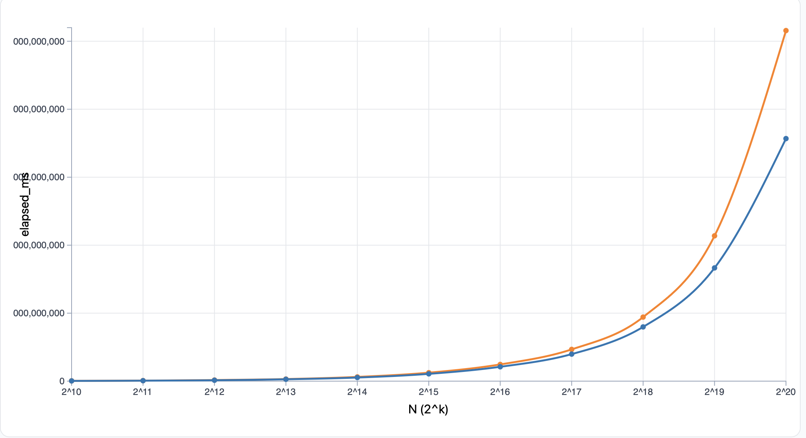
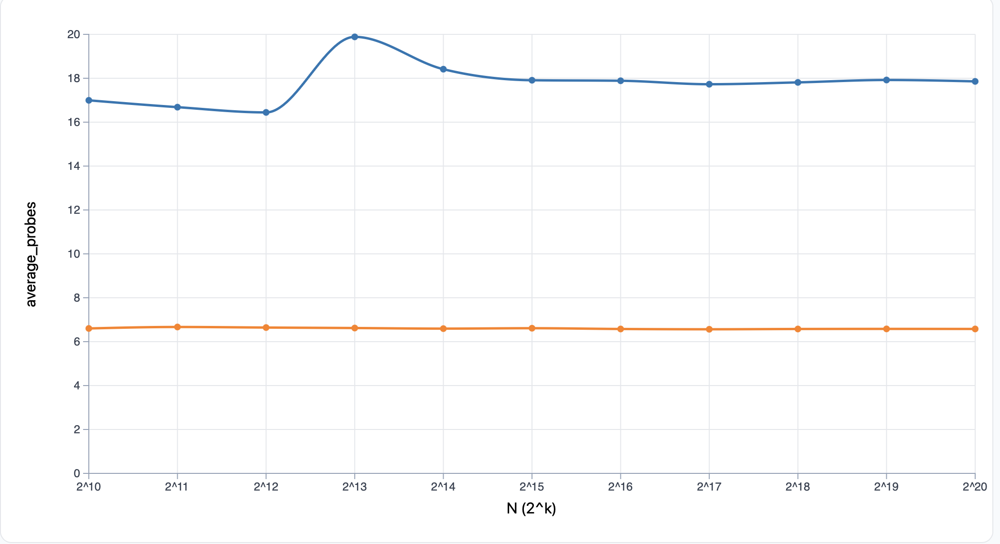
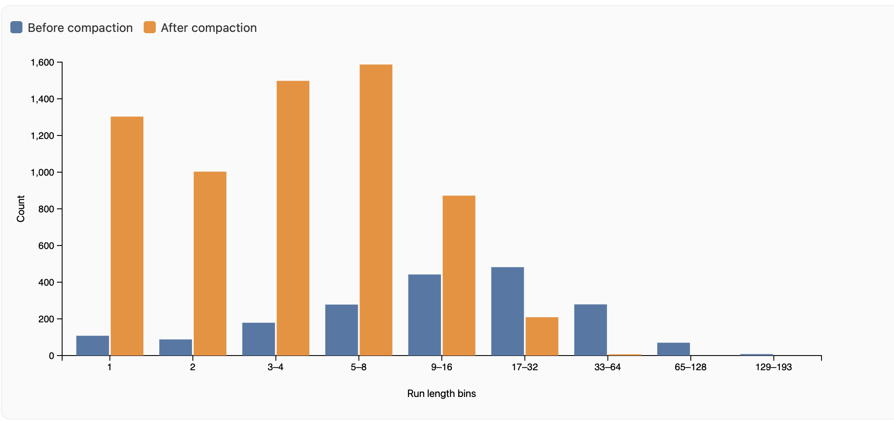

# Empirical Comparison of Single and Double Hashing for an LRU Profile
**Name:** Kevin Rodriguez  
**Project:** 5 Part 2

## Abstract
In this experiment, I compared Single Hashing and Double Hashing with compaction under an LRU profile. I noticed that the average probing for Double Hashing was about 1/3 of the amount compared to Single Hashing. Which lead me to believe it would have a better runtime. So naturally; in terms of elapsed time, I assumed Single Hashing would be less efficient due to more probes, but as N got larger, Double Hashing actually cost more time. I also observed that tombstones for both hovered below 15%, which I believe is due to compaction constantly cleaning them up.

**Headline:** Single Hashing outperformed Double Hashing in elapsed time at large N, despite Double Hashing reducing probes by ~66%.

## 1. Question and Hypotheses
**Question:** How does Single Hashing compare to Double Hashing in terms of efficiency and time under an LRU profile?
**Hypothesis:** In terms of elapsed time I would have assumed that single hasing would have been less efficient with the amount of "avg" probes.

## 2. Method
**API:** Insert, Remove 
**Items:** String keys with unique IDs.
**Traces:** Generated with fixed seeds. Correctness verified against an Oracle.
**Timing:** Measured only the replay loop. Medians reported over trials.
**Implementations:** Open Addressing with Single Hashing vs. Double Hashing.
**Environment:** Local macOS.

## 3. Datasets
**Profile:** LRU (Least Recently Used) simulation.
**Key Distribution:** Real English words.
**Sizes:** N = 1024 to 1,048,576 (powers of 2).

## 4. Results by Profile

### LRU Profile
**Figure 1:** Time vs N.

**Result:** As the size of N got larger it seems double hashing costed more time.

**Figure 2:** Average Probes vs N.

**Result:** When viewing into the LRU profiles I notice that the average probing between double hasing with compact vs single hashing with compaction that The average probes on the double is aobut 1/3 of the amount compared to single probing.

**Figure 3:** Occupancy (Tombstones).

**Result:** When I viewed occupancy chart i can see that the tombstones for both hover below 15%.

**Figure 4:** Cluster Size Histogram (N=32768).

**Result:** The blue bars (Single Hashing) grew in size peaking at 17-32 runs. While the orange bars (Double Hashing) are significantly taller in the 1-16 bins and drop off quickly. This shows that Double Hashing creates smaller clusters (shorter run lengths), while Single Hashing suffers from long clusters.

## 5. Discussion
**Expectations vs. Observations**
Given what I have been learning in my CS351 Computer architechture class we have been learning that computers love reading things sequentially. So linear probing is exactly that. While double hashing is randomly accessing memory jumping around to find new memory pages which is less time efficient. This is because sequential access keeps data in the fast CPU cache, whereas jumping around causes "cache misses", forcing the CPU to fetch data from the much slower RAM. I believe that this is due to the compaction constantly cleaning up the tombstones before it can reach a higher %.

## 6. Takeaway
In conclusion, while Double Hashing is superior for reducing the amount of probes (about 1/3 of Single Hashing), Single Hashing is practically faster for this LRU workload due to CPU cache efficiency. However, neither would work well without Compaction, which is the essential mechanism that keeps the table from filling up with tombstones. Making the probing process much faster.

**Artifacts:** To reproduce these results, please refer to `README.md` for exact compilation and execution commands.
